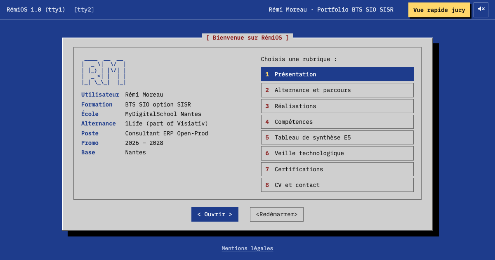

# RémiOS — portfolio BTS SIO SISR



Portfolio de **Rémi Moreau**, étudiant en BTS SIO option SISR à MyDigitalSchool Nantes (promo 2026-2028), en alternance chez 1Life (groupe Visiativ) comme consultant ERP Open-Prod.

Le site se présente comme le démarrage d'un système Linux : écran GRUB, journal du noyau, services systemd, puis un menu façon ncurses qui donne accès aux réalisations, au tableau de synthèse et à la veille technologique. Une **vue rapide jury**, sobre et imprimable, rassemble tout le contenu sur une seule page.

## Sommaire

- [Démarrer en local](#démarrer-en-local)
- [Ce que fait le site](#ce-que-fait-le-site)
- [Modifier le contenu](#modifier-le-contenu)
- [Ce qui reste à compléter](#ce-qui-reste-à-compléter)
- [Architecture](#architecture)
- [Choix techniques](#choix-techniques)
- [Qualité mesurée](#qualité-mesurée)
- [Mettre en ligne sur remim.me (GitHub Pages)](#mettre-en-ligne-sur-remimme-github-pages)
- [Autre option : héberger sur le homelab (Docker + nginx)](#autre-option--héberger-sur-le-homelab-docker--nginx)
- [Préparer l'oral](#préparer-loral)
- [Étapes de construction](#étapes-de-construction)
- [Crédits et licences](#crédits-et-licences)

## Démarrer en local

Prérequis : **Node.js 22.12 ou plus récent** (version conseillée : 24 LTS, indiquée dans `.nvmrc`).

```bash
npm install      # installe les outils du projet (à faire une fois)
npm run dev      # lance le site en local, avec rechargement automatique à chaque modification
npm run build    # fabrique la version finale, 100 % statique, dans dist/
npm run preview  # sert le contenu de dist/ pour vérifier le build avant de le déployer
```

`npm run dev` affiche l'adresse à ouvrir dans le navigateur (par défaut http://localhost:5173). Toute modification d'une fiche ou du code s'affiche immédiatement.

## Ce que fait le site

1. **Démarrage** (à l'arrivée sur l'accueil, 5 secondes au maximum) : GRUB, messages du noyau, services systemd détournés avec mes projets (`jellyfin.service`, `alternance@1life.service`…), connexion automatique, puis `portfolio --menu`. Le bouton « Passer le démarrage », n'importe quelle touche ou un clic l'interrompent. Si le système demande de réduire les animations, le site arrive directement sur le menu.
2. **Menu façon whiptail** : identité façon neofetch à gauche, 7 rubriques numérotées à droite. Chaque rubrique s'ouvre dans une boîte de dialogue avec `< Retour >`. `<Redémarrer>` rejoue le démarrage.
3. **Fiches de réalisation** : contexte, objectifs, mise en œuvre, captures (agrandissables), résultats, difficultés, compétences du référentiel. Chaque fiche a sa propre adresse, partageable.
4. **Vue rapide jury** : bouton jaune en haut à droite, visible en permanence (même pendant le démarrage). Version classique, fond clair, tout sur une page, imprimable.
5. **Terminal caché** : `remi@remios:~$`, avec historique, autocomplétion et une douzaine de commandes. Les fiches y sont des fichiers. Tout est simulé.
6. **Sons** (coupés par défaut) : bip POST, clics de disque, bip de validation, générés par le navigateur.

### Raccourcis clavier

| Touche | Effet |
|---|---|
| ↑ ↓ | se déplacer dans le menu ou dans une liste de fiches |
| Entrée | ouvrir l'élément sélectionné |
| 1 à 7 | ouvrir directement une rubrique (depuis le menu) |
| Échap ou Retour arrière | revenir à l'écran précédent |
| n'importe quelle touche (sauf Tab) | passer le démarrage |
| `` ` `` ou `²` (AZERTY PC), `Ctrl+Alt+T` (`Ctrl+Option+T` sur Mac) | ouvrir le terminal |
| Tab, ↑ ↓, Ctrl+L, Échap | dans le terminal : compléter, historique, effacer, fermer |

Sur mobile, le terminal s'ouvre avec le bouton `[tty2]` de la barre du haut.

### Adresses

| Adresse | Écran |
|---|---|
| `#/` | menu principal (avec le démarrage) |
| `#/presentation`, `#/entreprise`, `#/formation`, `#/perso`, `#/synthese`, `#/veille`, `#/contact` | une rubrique |
| `#/realisations/<slug>` | une fiche, style RémiOS (ex. `#/realisations/nas`) |
| `#/jury` | vue rapide jury : **le lien à donner au jury** |
| `#/jury/<slug>` | une fiche, style sobre |

Un lien direct vers une rubrique, une fiche ou la vue jury s'affiche sans jouer le démarrage.

## Modifier le contenu

Tout le contenu est dans `content/` : aucune ligne de code à toucher.

- **Informations générales** (contact, sujet de veille, compétences, PDF, services affichés au démarrage) : `content/site.config.js`, commenté ligne par ligne.
- **Présentation et veille** : `content/pages/presentation.md` et `content/pages/veille.md`.
- **Ajouter une réalisation** : copier une fiche de `content/realisations/`, la renommer (minuscules, chiffres et tirets : `supervision-zabbix.md`), puis remplir le bloc d'en-tête :

  ```yaml
  titre: "Supervision du réseau avec Zabbix"
  slug: supervision-zabbix        # identique au nom du fichier
  type: entreprise                # entreprise, formation ou perso
  date: 2026-11                   # AAAA, AAAA-MM, AAAA-MM-JJ ou période 2026-01/2026-08
  statut: terminé
  resume: "Une phrase qui résume la réalisation."
  technos: [Zabbix, Debian]
  competences: [C1, C4]           # codes définis dans site.config.js
  ```

  La fiche apparaît automatiquement dans sa rubrique, dans la vue jury, dans le tableau croisé et dans le terminal.
- **Captures d'écran** : déposer l'image dans `public/captures/<slug>/` (format `.webp` conseillé, plus léger), puis l'insérer dans la fiche avec ``.
- **PDF** (CV, tableau de synthèse) : déposer le fichier dans `public/docs/`, puis indiquer son chemin dans `content/site.config.js` (`cv: 'docs/cv.pdf'`).

Les textes `[À COMPLÉTER]` sont surlignés en jaune sur le site. Si une fiche est mal remplie (type inconnu, slug différent du nom de fichier, image ou PDF introuvable, compétence inexistante…), `npm run dev` et `npm run build` s'arrêtent avec un message qui indique le fichier et la correction à faire : un site incomplet ne peut pas partir en production par erreur.

## Ce qui reste à compléter

Pour retrouver tous les repères : dans VS Code, `Cmd+Maj+F` puis `À COMPLÉTER`.

- [ ] **Présentation** : relire le texte (rédigé à partir des informations connues) et ajouter ce qui m'attire dans l'infrastructure et mon projet après le BTS.
- [ ] **Réalisations 1Life** (3 fiches vides) : titres et contenu, après accord du tuteur sur ce qui peut être montré (noms de clients, captures d'Open-Prod à flouter).
- [ ] **Homelab Jellyfin, NAS, CAFFEIN, Crypto Dashboard Pro** : détails techniques balisés `[À COMPLÉTER]`, captures.
- [ ] **Grille de compétences** : remplacer C1 à C6 dans `site.config.js` par la grille officielle du tableau de synthèse, puis renseigner `competences` dans chaque fiche.
- [ ] **PDF** : CV et tableau de synthèse.
- [ ] **Veille** : choisir le sujet (`veille.sujet`, le `[ WARN ]` du démarrage passera en `[  OK  ]`), puis rédiger `content/pages/veille.md`.
- [ ] **Réalisations en formation** : la rubrique affiche « À venir » tant qu'il n'y en a pas.

## Architecture

### Vue d'ensemble

```
content/*.md + site.config.js          (le contenu, modifiable sans code)
        │  au build : plugins/vite-plugin-content.js (gray-matter + marked)
        ▼
modules JavaScript { meta, html, raw }  (fiches déjà converties en HTML)
        │
        ▼
src/content.js ──► src/blocks.js ──┬──► src/tui/    interface RémiOS (menu, rubriques, fiches)
                                   ├──► src/jury/   vue rapide jury
                                   └──► src/terminal/  (cat lit le texte source des fiches)

src/main.js assemble le tout : routeur, démarrage, interface, vue jury, terminal, sons.
```

### Ce qui se passe quand on ouvre le site

1. Le navigateur charge `index.html` (2 Ko), la police (préchargée), une feuille CSS et un fichier JavaScript : 53 Ko en tout.
2. `main.js` construit la page et affiche **tout de suite** l'écran demandé par l'URL.
3. Si l'URL est l'accueil, le calque du démarrage est posé par-dessus le menu, qui devient « inerte » le temps du boot.
4. Une boucle `requestAnimationFrame` déroule le planning du boot image par image ; à la fin (ou dès qu'on passe), le calque disparaît et le focus clavier arrive sur le menu.
5. Chaque clic sur une rubrique change le hash de l'URL (`#/veille`) ; le routeur le détecte et affiche la boîte correspondante, sans recharger la page.

### Organisation des fichiers

```
content/site.config.js   configuration : identité, contact, PDF, veille, compétences, services du boot
content/pages/           présentation et veille (Markdown)
content/realisations/    une fiche Markdown par réalisation
index.html               page unique : meta, Open Graph, préchargement de la police
vite.config.js           configuration du build
plugins/                 plugin Vite maison : Markdown → HTML au build, vérification des fiches
public/                  copié tel quel dans dist/ : icônes, image d'aperçu, robots.txt, captures, PDF
src/main.js              point d'entrée : assemble les modules, clavier global
src/router.js            routage par hash (#/presentation, #/realisations/nas…)
src/content.js           accès au contenu (configuration + fiches) pour le reste du code
src/blocks.js            blocs de contenu communs à RémiOS et à la vue jury
src/tui/                 interface whiptail : boîte, accueil, rubriques, fiches, visionneuse d'images
src/boot/                démarrage : écran GRUB, contenu du journal, déroulement (sequence.js)
src/jury/                vue rapide jury
src/terminal/            terminal : fenêtre, commandes, système de fichiers simulé
src/audio/               sons générés avec la Web Audio API
src/ui/                  barre fixe en haut à droite (vue jury, bouton son), titre de l'onglet
src/utils/               petites fonctions partagées : HTML sûr, dates, clavier, réglages mémorisés
src/styles/              un fichier CSS par partie (tokens.css = toutes les couleurs, print.css = impression)
src/assets/fonts/        IBM Plex Mono en woff2 (400 et 600) + licence OFL
.github/workflows/       publication automatique sur GitHub Pages (remim.me)
Dockerfile, docker/      image Docker et configuration nginx (hébergement sur le homelab)
docker-compose.yml       lancement du conteneur sur le homelab
reference/               maquette HTML validée au départ du projet (hors build)
```

## Choix techniques

### Construction et contenu

- **Vite + JavaScript sans framework.** Le site n'a pas besoin de React ou Vue : quelques modules JavaScript suffisent, le code reste court et facile à expliquer, et le navigateur n'a presque rien à télécharger. Vite apporte le serveur de développement (rechargement instantané) et le build optimisé : fichiers minifiés et noms de fichiers « hashés » (`index-3f9a2c.js`).
- **Aucune dépendance au moment de l'exécution.** Vite, `gray-matter` et `marked` ne servent qu'à fabriquer le site (`devDependencies`) ; le visiteur reçoit uniquement mon code et du HTML déjà prêt.
- **Contenu en Markdown, converti et vérifié au build.** Chaque réalisation est un fichier texte lisible. Le plugin `plugins/vite-plugin-content.js` lit l'en-tête avec `gray-matter`, convertit le texte en HTML avec `marked`, rend les images cliquables et vérifie chaque champ.
- **Un contenu, deux habillages.** Les rubriques sont produites par `src/blocks.js` ; l'interface RémiOS et la vue jury les habillent différemment. Le tableau croisé réalisations × compétences est généré à partir des fiches : il est toujours à jour.
- **Routage par hash.** Tout le site tient dans `index.html` ; la partie après `#` indique l'écran à afficher. Chaque écran a une URL partageable, Précédent/Suivant fonctionnent, et le serveur n'a besoin d'aucune règle de réécriture.
- **Chemins relatifs (`base: './'`).** Le site fonctionne à la racine d'un domaine comme dans un sous-dossier derrière un reverse proxy, sans reconfiguration.

### Interface

- **Boot en calque, par-dessus le menu.** Le menu est affiché dès le chargement ; le boot est un calque posé dessus pendant 5 secondes au maximum. « Passer » retire simplement le calque. Pendant le boot, le menu est rendu « inerte » (attribut `inert`) pour que la touche Tab ne s'y perde pas.
- **Boot seulement à l'accueil.** Un lien direct affiche la page sans attendre. Le service `veille-techno.service` passe de `[ WARN ]` à `[  OK  ]` dès qu'un sujet de veille est renseigné.
- **Terminal entièrement simulé.** L'arborescence (`~/realisations/perso/nas.md`…) est construite en mémoire à partir du contenu. Aucune commande n'est exécutée, rien n'est envoyé à un serveur.
- **Easter egg du terminal.** La commande cachée `starwars` (ou `telnet towel.blinkenlights.nl`, clin d'œil au célèbre film en ASCII) joue pendant 30 secondes un générique façon Star Wars : intro, titre qui s'éloigne, texte en perspective. Le texte est une parodie originale, et la fanfare (si le son est activé) une composition originale : ni le film, ni son texte, ni sa musique, protégés par le droit d'auteur, ne sont reproduits. Rendu rétro : le générique est dessiné dans un `<canvas>` en basse résolution (un « pixel rétro » = 3 pixels d'écran), agrandi sans lissage (`image-rendering: pixelated`) pour un effet pixelisé qui reste à 60 images/s, avec un filtre CSS de contraste et une couche d'écran cathodique (lignes de balayage, coins assombris, scintillement discret). Un filtre SVG de pixelisation avait d'abord été essayé : il faisait tomber l'animation à 25 images/s. Échap, `q` ou le bouton « Arrêter » l'interrompent ; en animations réduites, le texte s'affiche simplement.
- **Sons synthétisés.** Bip POST (oscillateur carré à 1 000 Hz), clics de disque (bruit filtré) et bip de validation sont fabriqués par la Web Audio API : aucun fichier audio. Les navigateurs interdisent le son avant une interaction : le contexte audio n'est créé qu'au premier clic ou à la première touche. Au tout premier chargement, le bip POST ne peut donc pas sonner ; il sonne sur `<Redémarrer>`, ou dès que le son est activé pendant le boot.
- **Titre d'onglet façon invite de commande.** L'onglet affiche « RémiOS_ », et le « _ » clignote comme un curseur de terminal (toutes les 530 ms). Sur une rubrique ou une fiche, le nom de la page reste devant (« Présentation — RémiOS_ ») pour l'historique, les favoris et les lecteurs d'écran. La vue jury garde un titre fixe, et le curseur ne clignote pas si le système demande de réduire les animations.
- **Réglages mémorisés prudemment.** Le choix du son est gardé dans `localStorage`, dont chaque accès est protégé (`try/catch`) : en navigation privée ou si le stockage est bloqué, le site fonctionne quand même.

### Accessibilité

- **Vrais éléments HTML.** Rubriques et fiches sont des liens `<a>`, les actions des `<button>` : souris, tactile, clavier et lecteurs d'écran fonctionnent sans code spécial.
- **Focus maîtrisé.** Contour de focus visible (adapté à chaque fond), focus placé sur le titre de chaque boîte ouverte, zone `aria-live` qui annonce la rubrique ouverte et la fin du démarrage.
- **Vue jury en un clic.** Bouton visible en permanence et premier élément atteint avec Tab, ou adresse directe `#/jury`.
- **Visionneuse et terminal en `<dialog>` natif.** Le navigateur gère le piège du focus, la touche Échap et le retour du focus à la fermeture.
- **Réduction des animations respectée.** Pas de boot, pas de transition si le système le demande.
- **Contrastes AA** (au moins 4,5:1) pour tous les textes, tailles en `rem` (le site suit l'agrandissement du texte du navigateur).

### Performance

- **Boot à 60 images/s, sans décalage de mise en page.** Une seule boucle `requestAnimationFrame` traite à chaque image les lignes dont l'heure est venue. L'écran du journal est une grille fixe de lignes, créées une seule fois : pour faire défiler, on réécrit seulement leur texte. Aucun élément n'est ajouté ni déplacé, donc aucun « décalage de mise en page » (CLS passé de 0,44 à 0 grâce à ce choix). Le seul effet animé, le curseur clignotant, n'utilise que l'opacité. À la fin, pas de fondu : l'écran bascule d'un coup sur le menu, comme un vrai système.
- **Police auto-hébergée et préchargée.** IBM Plex Mono est servie par le site lui-même : pas de Google Fonts, donc fonctionnement hors ligne et aucune donnée de visite transmise à un tiers. Seuls le sous-ensemble latin et deux graisses sont embarqués (≈ 30 Ko).
- **Cache long.** Les fichiers hashés sont gardés un an par le navigateur ; `index.html` n'est jamais mis en cache, donc une nouvelle version est visible immédiatement.

### Sécurité

- **Site 100 % statique** : pas de base de données, pas de code exécuté sur le serveur, pas de formulaire. La surface d'attaque se limite à nginx.
- **Aucune injection possible.** Ce que tape le visiteur dans le terminal est affiché avec `textContent`, jamais interprété comme du HTML. Les textes de la configuration sont échappés avant affichage.
- **CSP stricte** (`script-src 'self'`) : le navigateur refuse tout script externe ou injecté. Possible parce que le site n'a aucun script ni style écrit dans le HTML. Sur GitHub Pages, qui ne permet pas d'envoyer des en-têtes HTTP, elle est ajoutée au build dans une balise `<meta>` ; la version Docker l'envoie en plus dans les en-têtes nginx.
- **HTTPS** : certificat fourni et renouvelé automatiquement par GitHub Pages.
- **Conteneur durci** : image multi-stage (aucun outil de build dans l'image finale), système de fichiers en lecture seule, pas d'élévation de privilèges, version de nginx masquée, en-têtes de sécurité (anti-clickjacking, nosniff, Referrer-Policy, Permissions-Policy).
- **Liens externes** ouverts avec `rel="noopener noreferrer"` : la page ouverte ne peut pas agir sur le portfolio.

## Qualité mesurée

Audit Lighthouse 13 sur le build (`npm run build` puis `npm run preview`), le 24 septembre 2026 :

| Page | Performance | Accessibilité | Bonnes pratiques | SEO |
|---|---|---|---|---|
| Accueil (mobile) | 100 | 100 | 100 | 100 |
| Accueil (ordinateur) | 100 | 100 | 100 | 100 |
| Vue jury (mobile) | 100 | 100 | 100 | 100 |
| Fiche de réalisation (mobile) | 100 | 100 | 100 | 100 |

Accueil mobile : premier affichage 1,1 s, plus grand élément affiché 1,2 s, aucun blocage du navigateur (TBT 0 ms), aucun décalage de mise en page (CLS 0). Poids total de la page : 53 Ko.

Pendant la construction, chaque étape a aussi été testée dans un navigateur piloté par script (navigation au clavier, démarrage, terminal, sons, impression, mobile) et avec axe-core (règles d'accessibilité WCAG 2.2 AA) sur chaque écran : aucune erreur, et aucune page ne défile horizontalement, même sur un écran de 320 px. La politique de sécurité (CSP) a été vérifiée en servant le site avec les mêmes en-têtes que nginx : aucune ressource bloquée.

Pour refaire l'audit : ouvrir le site dans Chrome, outils de développement (F12), onglet **Lighthouse**.

## Mettre en ligne sur remim.me (GitHub Pages)

### Principe

```
Code sur GitHub ──push──► GitHub Actions ──► GitHub Pages ──► https://remim.me
(moreauremi.github.io)    fabrique et          héberge le site,
                          vérifie le site      fournit le HTTPS
```

- Le code est dans le dépôt GitHub `moreauremi/moreauremi.github.io`.
- À chaque envoi (`push`) sur la branche `main`, le workflow `.github/workflows/deploy.yml` installe les outils, fabrique le site (ce qui vérifie aussi les fiches) et publie le dossier `dist/`. Si une fiche est mal remplie, la publication s'arrête et le site en ligne reste intact.
- Le domaine `remim.me`, obtenu gratuitement chez Namecheap grâce au GitHub Student Pack, pointe vers les serveurs de GitHub Pages.

### Réglages à faire une seule fois (sur github.com)

1. Ouvrir le dépôt `moreauremi.github.io`, puis **Settings → Pages**.
2. Dans **Build and deployment → Source**, choisir **GitHub Actions** (et non « Deploy from a branch »).
3. Dans **Custom domain**, vérifier que `remim.me` est indiqué (sinon le saisir, puis **Save**).
4. Cocher **Enforce HTTPS**. La case devient cliquable une fois le certificat délivré : de quelques minutes à 24 h après la configuration du domaine.

### DNS chez Namecheap (déjà en place)

**Domain List → remim.me → Manage → Advanced DNS** :

| Type | Host | Value |
|---|---|---|
| A Record | `@` | `185.199.108.153` |
| A Record | `@` | `185.199.109.153` |
| A Record | `@` | `185.199.110.153` |
| A Record | `@` | `185.199.111.153` |
| CNAME Record | `www` | `moreauremi.github.io.` (conseillé par GitHub ; `remim.me.` fonctionne aussi) |

Ces adresses sont celles des serveurs de GitHub Pages. Vérification depuis un terminal : `dig +short remim.me` doit afficher les quatre adresses.

### Première mise en ligne

Le projet est déjà relié au dépôt GitHub (`git remote -v` affiche `origin`). Une fois le réglage « Source : GitHub Actions » fait, il suffit d'envoyer le code :

- **dans VS Code** : onglet **Contrôle de code source** (icône des branches), bouton **Synchroniser les modifications** ou **Publier la branche** ; VS Code demande de se connecter à GitHub la première fois ;
- **ou dans un terminal** : `git push -u origin main`.

Suivre la publication dans l'onglet **Actions** du dépôt (1 à 2 minutes), puis ouvrir https://remim.me. Le lien à donner au jury : **https://remim.me/#/jury**.

Le dépôt est public : le code, le README et le CV sont visibles sur GitHub, comme ils le sont déjà sur le site. Le dossier `a-integrer/` (documents de travail) est exclu de git et n'est jamais publié.

### Mettre à jour le site

Modifier une fiche ou la configuration, vérifier en local avec `npm run dev`, faire un commit, puis envoyer (Synchroniser dans VS Code, ou `git push`). Le site est à jour une à deux minutes plus tard.

## Autre option : héberger sur le homelab (Docker + nginx)

Le projet contient aussi tout le nécessaire pour héberger le site sur le homelab, avec des en-têtes de sécurité complets envoyés par nginx. Utile pour une démonstration technique à l'oral ; le site public, lui, est sur GitHub Pages.

### Principe

```
Navigateur ──► reverse proxy nginx du homelab ──► conteneur « remios-portfolio »
                (HTTPS, nom de domaine)              nginx:alpine + le dossier dist/
                                                     port 80 du conteneur = port 8080 de la machine
```

Le `Dockerfile` construit l'image en deux étapes (*multi-stage*) : une image Node fabrique le site, puis seul le dossier `dist/` est copié dans une image `nginx:alpine`. L'image finale ne contient ni Node, ni le code source : elle est légère et expose le minimum.

| Fichier | Rôle |
|---|---|
| `Dockerfile` | construction de l'image (build Node → service nginx), vérification de santé |
| `docker/nginx.conf` | service du site : gzip, cache d'un an sur les fichiers hashés, `index.html` jamais en cache, 404 pour les adresses inconnues |
| `docker/security-headers.conf` | en-têtes de sécurité (CSP stricte, anti-clickjacking, nosniff…) |
| `docker-compose.yml` | lancement : port 8080, redémarrage automatique, lecture seule, pas d'élévation de privilèges |
| `.dockerignore` | fichiers non envoyés à Docker (node_modules, dist, .git…) |

### Étape 1 : copier le projet sur le serveur

Prérequis sur le serveur : Docker et son plugin compose (`docker compose version` doit répondre).

Depuis le Mac, dans le dossier du projet (remplacer `remi@homelab` par l'utilisateur et l'adresse du serveur) :

```bash
rsync -av --exclude node_modules --exclude dist ./ remi@homelab:~/remios-portfolio/
```

L'image est construite sur le serveur lui-même : peu importe que ce soit un PC (amd64) ou un Raspberry Pi (arm64), les images `node:24-alpine` et `nginx:alpine` existent pour les deux.

### Étape 2 : construire et lancer le conteneur

```bash
ssh remi@homelab
cd ~/remios-portfolio
docker compose up -d --build
```

### Étape 3 : vérifier

```bash
docker ps                          # STATUS doit passer à « (healthy) » au bout de 30 s
curl -I http://localhost:8080/     # HTTP/1.1 200 OK + en-têtes de sécurité
docker compose logs -f             # journaux de nginx (Ctrl+C pour quitter)
```

Depuis un autre poste du réseau local : `http://<adresse-IP-du-homelab>:8080`.

Pour vérifier la compression : `curl -sI -H "Accept-Encoding: gzip" http://localhost:8080/ | grep -i content-encoding` doit afficher `gzip`.

### Étape 4 : brancher le reverse proxy nginx

Le reverse proxy nginx du homelab tourne **dans un conteneur Docker**. Attention : à l'intérieur de ce conteneur, `127.0.0.1` désigne le conteneur nginx lui-même, pas la machine. Il y a deux façons de joindre le portfolio ; choisir l'une des deux, puis utiliser l'adresse obtenue à la place de `<PORTFOLIO>` dans les exemples plus bas.

**Option A, la plus simple : l'adresse IP de la machine.** Le portfolio publie le port 8080 sur la machine, que le conteneur nginx peut joindre par l'adresse IP locale du homelab (`hostname -I` sur le serveur pour la connaître). `<PORTFOLIO>` vaut alors par exemple `192.168.1.10:8080`.

**Option B, plus propre : un réseau Docker commun.** Les deux conteneurs se parlent directement, sans passer par un port de la machine.

1. Trouver le réseau du conteneur nginx (remplacer `nginx` par le nom de son conteneur, visible avec `docker ps`) :

   ```bash
   docker inspect nginx --format '{{range $nom, $r := .NetworkSettings.Networks}}{{$nom}} {{end}}'
   ```

2. Ajouter à la fin de `docker-compose.yml` (remplacer `nom-du-reseau` par le résultat de la commande) :

   ```yaml
   networks:
     default:
       name: nom-du-reseau
       external: true
   ```

3. Relancer : `docker compose up -d`. `<PORTFOLIO>` vaut alors `remios-portfolio:80` (le nom du conteneur sert d'adresse). La ligne `ports:` peut rester, pour tester directement sur le port 8080.

**Sans nom de domaine** (situation actuelle) : publier le site dans un sous-dossier de l'adresse du homelab, par exemple `http://192.168.1.10/portfolio/`. Dans le bloc `server` existant de la configuration nginx :

```nginx
# « /portfolio » sans barre finale → redirection vers « /portfolio/ »
location = /portfolio {
    return 301 /portfolio/;
}

location /portfolio/ {
    # Le « / » final retire « /portfolio/ » avant de transmettre au conteneur
    proxy_pass http://<PORTFOLIO>/;
    proxy_set_header Host $host;
    proxy_set_header X-Real-IP $remote_addr;
    proxy_set_header X-Forwarded-For $proxy_add_x_forwarded_for;
    proxy_set_header X-Forwarded-Proto $scheme;
}
```

Ça fonctionne sans rien changer au site grâce aux chemins relatifs (`base: './'`). Vérifier puis recharger la configuration (remplacer `nginx` par le nom du conteneur) :

```bash
docker exec nginx nginx -t && docker exec nginx nginx -s reload
```

**Avec un nom de domaine** (plus tard) :

```nginx
server {
    listen 80;
    server_name portfolio.exemple.fr;
    return 301 https://$host$request_uri;
}

server {
    listen 443 ssl;
    http2 on;
    server_name portfolio.exemple.fr;

    ssl_certificate     /etc/letsencrypt/live/portfolio.exemple.fr/fullchain.pem;
    ssl_certificate_key /etc/letsencrypt/live/portfolio.exemple.fr/privkey.pem;

    # HTTPS obligatoire pendant un an (à mettre ici : c'est le proxy qui gère le HTTPS)
    add_header Strict-Transport-Security "max-age=31536000" always;

    location / {
        proxy_pass http://<PORTFOLIO>;
        proxy_set_header Host $host;
        proxy_set_header X-Real-IP $remote_addr;
        proxy_set_header X-Forwarded-For $proxy_add_x_forwarded_for;
        proxy_set_header X-Forwarded-Proto $scheme;
    }
}
```

Puis renseigner `urlPublique: 'https://portfolio.exemple.fr/'` dans `content/site.config.js` et reconstruire (étape 5) : les aperçus de lien (image, adresse) seront alors complets.

### Étape 5 : mettre à jour le site

Après une modification (nouvelle fiche, captures…), depuis le Mac :

```bash
rsync -av --exclude node_modules --exclude dist ./ remi@homelab:~/remios-portfolio/
ssh remi@homelab "cd ~/remios-portfolio && docker compose up -d --build && docker image prune -f"
```

`docker image prune -f` supprime les anciennes versions de l'image.

### Dépannage

- **Le port 8080 est déjà pris** : `PORTFOLIO_PORT=8090 docker compose up -d` (et adapter `proxy_pass`).
- **Le build échoue** : lire le message, il indique souvent une fiche mal remplie ; le corriger et relancer. Le même message apparaît en local avec `npm run build`.
- **Le conteneur redémarre en boucle** : `docker compose logs`. Si nginx se plaint d'un système de fichiers en lecture seule, mettre en commentaire les lignes `read_only`, `tmpfs` et leurs dossiers dans `docker-compose.yml`, puis relancer.
- **Seul le reverse proxy doit accéder au conteneur** : utiliser l'option B (réseau Docker commun) et supprimer la ligne `ports:` ; le site n'est alors plus joignable directement depuis le réseau.

## Préparer l'oral

Questions probables du jury, et l'essentiel de la réponse.

**Pourquoi ne pas avoir utilisé WordPress ou un framework comme React ?**
Le site est statique : il n'a besoin ni de base de données ni de code côté serveur. Vite et du JavaScript simple suffisent, le code reste court, la page pèse 53 Ko, et il n'y a rien à mettre à jour côté sécurité en dehors de nginx.

**Comment une fiche Markdown devient-elle une page ?**
Au build, un plugin Vite que j'ai ajouté lit chaque fichier `.md` : `gray-matter` sépare l'en-tête (titre, type, compétences…) du texte, `marked` convertit le texte en HTML, et le plugin vérifie les champs. Si une fiche est mal remplie, le build s'arrête avec un message clair.

**Comment fonctionne la navigation sans rechargement ?**
Par le hash de l'URL (`#/realisations/nas`). Le navigateur ne recharge pas la page quand il change : il émet un événement `hashchange` que mon routeur écoute pour afficher le bon écran. Chaque écran a donc une adresse partageable, sans configuration côté serveur.

**Une animation de 5 secondes, ce n'est pas gênant pour le visiteur ou pour l'accessibilité ?**
Le menu est déjà affiché sous le démarrage, qui n'est qu'un calque : un clic, une touche ou le bouton « Passer » le retirent instantanément. Il ne se joue qu'à l'accueil, jamais sur un lien direct, et pas du tout si le système demande de réduire les animations. La vue jury reste accessible en un clic pendant le boot.

**Comment le démarrage reste-t-il fluide ?**
Une seule boucle `requestAnimationFrame`, synchronisée sur l'affichage de l'écran. Le journal est une grille de lignes fixes dont je réécris seulement le texte : rien ne bouge dans la page, ce qui a fait passer le décalage de mise en page mesuré par Lighthouse de 0,44 à 0.

**Le terminal est-il dangereux ?**
Non : il est entièrement simulé dans le navigateur, rien n'est exécuté ni envoyé au serveur. La saisie est affichée comme du texte brut (`textContent`) et la politique de sécurité du contenu (CSP) empêche tout script injecté de s'exécuter.

**Comment le site est-il hébergé ?**
Sur GitHub Pages, à l'adresse remim.me. Le domaine, obtenu gratuitement chez Namecheap grâce au GitHub Student Pack, pointe vers les serveurs de GitHub par quatre enregistrements DNS de type A (et un CNAME pour www) ; GitHub fournit le certificat HTTPS. À chaque push, un workflow GitHub Actions reconstruit le site, vérifie les fiches et le remet en ligne. Le projet contient aussi une image Docker durcie (build Node, puis nginx en lecture seule) pour l'héberger sur mon homelab.

**Quelles mesures de sécurité ?**
Site statique (pas de base de données, pas de formulaire), HTTPS, politique de sécurité du contenu (CSP) stricte qui bloque tout script externe ou injecté. Sur GitHub Pages, la CSP est dans une balise meta ; la version Docker ajoute les en-têtes HTTP complets (anti-clickjacking, nosniff…), masque la version de nginx et tourne dans un conteneur en lecture seule.

**Pourquoi héberger la police soi-même ?**
Pour que le site marche sans accès extérieur, et pour ne pas transmettre l'adresse IP des visiteurs à Google : en 2022, un tribunal de Munich a condamné un site qui chargeait Google Fonts sans consentement (RGPD).

**Comment ajoutez-vous une réalisation ?**
Je copie une fiche Markdown, je remplis l'en-tête et le texte, je dépose les captures dans `public/captures/`. Elle apparaît automatiquement dans le menu, la vue jury, le tableau de synthèse et le terminal. Je copie le projet sur le serveur et je relance `docker compose up -d --build`.

## Étapes de construction

Le projet a été construit en 12 étapes, une par commit git (`git log --oneline` pour les voir) :

1. Initialisation du projet (Vite, git, configuration de base)
2. Police auto-hébergée et thème RémiOS
3. Contenu en Markdown et fiches d'exemple
4. Menu principal et navigation
5. Fiches de réalisation et visionneuse d'images
6. Vue rapide jury imprimable
7. Séquence de démarrage
8. Terminal caché
9. Sons de démarrage
10. Responsive, accessibilité, performance
11. Déploiement Docker + nginx
12. Documentation complète

## Crédits et licences

- **IBM Plex Mono** : © IBM Corp., licence SIL Open Font License 1.1 (`src/assets/fonts/OFL.txt`).
- Outils de build (non envoyés aux visiteurs) : [Vite](https://vite.dev), [marked](https://marked.js.org), [gray-matter](https://github.com/jonschlinkert/gray-matter), tous sous licence MIT.
